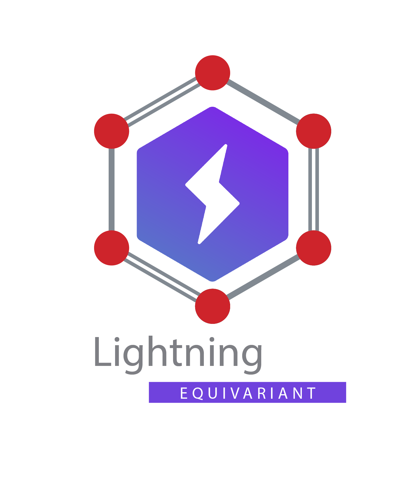

<div align="center">

# ⚡️ Lightning Equivariant

## Unifying Methodological Developments with Lightning Infrastrusture

  

[](https://lightning.ai/)
<!--
ARXIV   
[](https://www.nature.com/articles/nature14539)
-->


<!--  
Conference   
-->   
</div>
 
## Description

Lightning Equivariant provides a unique literature review, revisiting a number of important methodological developments in neural network design but presented under the unifying theoretical lens coined [Geometric Deep Learning](https://geometricdeeplearning.com/). This repository demonstrates the discovery utility afforded by the mere act utilizing one infrastructure framework for collating a vast number of architectures trained on various tasks, with associated datasets and benchmarks, along with reusable access to tests and utility functions, all documented under a unifying theoretical lens.

## Directory Structure and Usage

```
.
├── README.md
|
├── experiments                         # Synthetic experiments
│   ├── introduction.ipynb              # A gentle introduction to repository with interactive blocks to demonstrate research
│   ├── incompleteness.ipynb            # Experiment on counterexamples from Pozdnyakov et al.
│   ├── kchains.ipynb                   # Experiment on k-chains
│   └── rotsym.ipynb                    # Experiment on rotationally symmetric structures
| 
└── src                                 # Lightning Equivariant
    ├── blocks                          # Functionality 
    │   ├── irreps_tools.py
    │   ├── radial.py
    │   └── tensorproduct.py        
    │
    ├── data                            # Functionality used for training, plotting, etc.
    │   └── nbody_datamodule.py         # Simulate n-body systems with adjustible numerical accuracy
    │
    └── models                          # 5-Gs of Geometric Deep Learning
        ├── grids                 # Grids and Euclidean Spaces
        │
        ├── groups                # Groups and Homogeneous Spaces
        │   ├── ecnns.py                    # Group Equivariant CNNs (Cohen & Welling, 2016)
        │   └── harmonic.py                 # Harmonic Networks (Cohen & Welling, 2016)
        │
        ├── graphs                # Sets and Graphs
        │   ├── deep_sets.py      # (Zaheer et al., 2017)
        │   ├── gcnn.py           # (Kipf and Welling, 2016) (convolution-based)
        │   ├── gcnn2.py          # (Defferrard et al., 2016) (convolution-based)
        │   ├── sgc.py            # (Wu et al., 2019) (convolution-based)
        │   ├── gat.py            # (Veličković et al., 2018) (attention-based)
        │   ├── monet.py          # (Monti et al., 2017) (attention-based)
        │   ├── .py               # (Zhang et al., 2018) (attention-based)
        │   ├── .py               # (Gilmer et al., 2017)    (message passing)
        │   └── .py               # (Battaglia et al., 2018) (message passing)
        │
        ├── geodesics             # Geodesics and Manifolds
        │
        │── guages                # Guages and Bundles
        │
        └── geometric_gnn         # Geometric Graphs and Meshes
            ├── cormorant.py      # (Anderson & Hy & Kondor, 2019)
            ├── dimenet.py        # (Klicpera et al., 2020)
            ├── egnn.py           # (Satorras et al., 2021)
            ├── gvpgnn.py         # (Jing et al., 2020) 
            ├── mace.py           # (Batatia, 2022)
            ├── nequip.py         # (Batzner, 2022)
            ├── painn.py          # (Schütt, 2021)
            ├── schnet.py         # (Schütt et al., 2018)
            ├── se3transformer.py # (Fuchs et al., 2020)
            ├── segnn.py          # (Brandsetter et al., 2022)
            ├── spherenet.py      # (Lui et al., 2021)
            ├── steerable3d.py    # (Weiler et al., 2018)
            └── tensorfield.py    # (Thomas et al., 2018)
```

## How to run
First, install dependencies
```bash
# clone project   
git clone https://github.com/YourGithubName/deep-learning-project-template

# install project   
cd deep-learning-project-template 
pip install -e .   
pip install -r requirements.txt
 ```   
 Next, navigate to any file and run it.
 ```bash
# module folder
cd project

# run module (example: mnist as your main contribution)   
python lit_classifier_main.py    
```

## Imports
This project is setup as a package which means you can now easily import any file into any other file like so:
```python
from project.datasets.mnist import mnist
from project.lit_classifier_main import LitClassifier
from pytorch_lightning import Trainer

# model
model = LitClassifier()

# data
train, val, test = mnist()

# train
trainer = Trainer()
trainer.fit(model, train, val)

# test using the best model!
trainer.test(test_dataloaders=test)
```

### Acknowledgements

It should be noted that virtually none of the super interesting ideas pitched in this repo constitute the original work of this repo's author. These ideas have been refined and enhanced by numerous voices going back centuries. At the very least, I should express my deepest gratitude to the mathematicians, physicists, engineers, researchers, students, instructors, mentors, and open source contributers who have played some role the development of this subject.

That said, if by some chance your original idea or work is presented anywhere without a proper docstring or other refernce pointing to your work, I implore you to help me get it right by opening a pull request.

### Citation (IMPORTANT! PLEASE READ)

Again, virtually none of the super interesting ideas pitched in this repo constitute the original work of this repo's author. Should you need to cite any specific model, dataset, etc., please refer to the docstrings associated with that particular section. For all other citations, please adopt the following scheme.

```
@article{lightning-equivariant,
  title={Lightning Equivariant: Unifying Methodological Developments with Lightning Infrastrusture},
  author={Clayton Curry},
  journal={},
  year={2023}
}
```